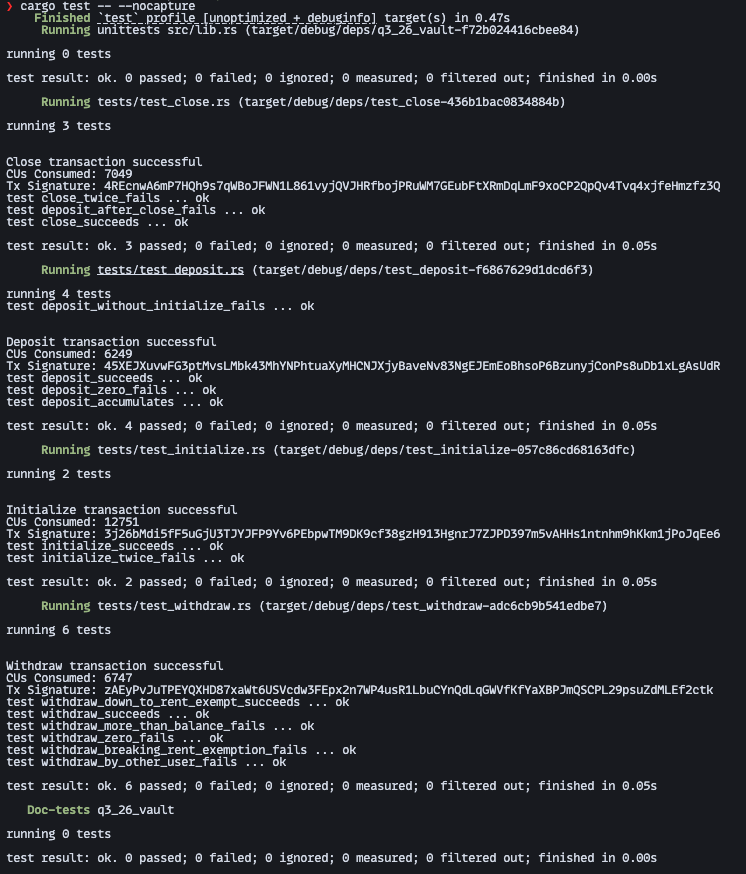

# Q3-26 Vault

An Anchor program that gives every user a personal lamport vault. Each user owns two PDAs — a state account holding the bumps, and the vault itself, a system-owned account with no private key that only the program can move funds out of. Built for the Turbin3 Q3 2026 Builder cohort.

Lifecycle: `initialize` → `deposit` ⇄ `withdraw` → `close`

## Instructions

| Instruction  | Args          | Effect                                                                      |
| ------------ | ------------- | --------------------------------------------------------------------------- |
| `initialize` | —             | Creates `VaultState` and funds the vault with the rent-exempt minimum       |
| `deposit`    | `amount: u64` | Transfers `amount` from the user to the vault                               |
| `withdraw`   | `amount: u64` | Transfers `amount` back to the user, keeping the vault above the rent floor |
| `close`      | —             | Drains the vault to the user and closes `VaultState`, refunding its rent    |

## Accounts

| Account       | Seeds              | Type                    |
| ------------- | ------------------ | ----------------------- |
| `vault_state` | `[b"state", user]` | `VaultState` (8 + 2 bytes) |
| `vault`       | `[b"vault", user]` | `SystemAccount`         |

`VaultState` stores only `vault_bump` and `state_bump`, so every later instruction re-derives both PDAs from the signer without a client-supplied bump.

## Errors

| Code | Name                       | Raised when                                            |
| ---- | -------------------------- | ------------------------------------------------------ |
| 6000 | `InvalidAmount`            | `deposit` or `withdraw` is called with `amount == 0`   |
| 6001 | `InsufficientVaultBalance` | A withdrawal would drop the vault below rent exemption |

## Design notes

- **The vault cannot be reaped.** `initialize` funds it to `Rent::minimum_balance(0)` and `withdraw` refuses any amount that would take it below that floor, so the account never becomes rent-collectable while it still holds user funds.
- **Over-withdrawal cannot wrap.** The floor check uses `checked_sub`, so an amount larger than the balance yields `None` and is rejected rather than silently underflowing.
- **Only the program can spend the vault.** The vault has no keypair; withdrawals are signed by the program with `[b"vault", user, bump]`.
- **Vaults are isolated by construction.** Both PDAs derive from `user.key()`, so pointing a foreign signer at someone else's vault fails Anchor's seeds constraint before any handler code runs.

## Build & test

```bash
anchor build   # required: the tests load target/deploy/q3_26_vault.so
cargo test
```



15 tests across the four instructions, covering both the success path and every guard. They run in-process on [LiteSVM](https://github.com/LiteSVM/litesvm) — no validator, no devnet, no airdrops — so the suite is fast and hermetic. Add `-- --nocapture` to see compute units per instruction.

Built with Anchor 1.2.0.

---

Reasoning log for the assignment: [APPROACH.md](APPROACH.md).